# islyp.com — Planejamento e catálogo de ideias visuais

**Registro:** 14 de setembro de 2026  
**Etapa:** hero, Sobre, duas faixas de tecnologias, cards e carrossel detalhado com celular 3D implementados localmente; demais seções seguem em planejamento.\
**Identidade visual escolhida:** definição parcial; hero e background seguem a imagem fornecida pelo usuário, e a identidade completa continua em refinamento.  
**Background atual aplicado:** [imagem vertical escolhida pelo usuário](assets/city-vertical.png), enviada como `Imagem do Codex 14 de set. de 2026, 20_07_05.png`, com céu de nuvens noturnas e cidade em silhuetas. É o mesmo cenário M14-01, com 724 × 2172 px. O usuário confirmou que essa altura é mais adequada para revelar o fundo aos poucos durante a rolagem. A aplicação avança a 28% da distância rolada pela página.  
**Referência atual de hero:** a mesma imagem enviada, agora também solicitada para o hero, com monitores de vidro ao redor do texto central.  
**Último estudo produzido:** M16 — Background de galeria clara, contínuo e vertical, baseado na nova imagem fornecida. É uma alternativa em avaliação, ainda não aplicada ao site. O cenário noturno atual permanece preservado.

Este documento reúne o contexto do portfólio, as ideias discutidas, o histórico das imagens e os pontos ainda em aberto. Os códigos servem para retomar uma proposta com precisão. A numeração é cronológica, não representa classificação ou preferência.

> Atualização de 14/09/2026: o usuário autorizou desenvolver primeiro o hero e depois a seção Sobre, parte por parte. O hero possui painéis de vidro flutuantes, movimento curto de ida e volta, arraste livre com inércia e desaceleração, e cidade acompanhando a rolagem aos poucos. A seção Sobre usa a foto real enviada em `copia.jpg`, com fundo removido, e o texto da referência. Detalhes em [HERO-IMPLEMENTACAO.md](HERO-IMPLEMENTACAO.md) e [SOBRE-ASSETS.md](design/SOBRE-ASSETS.md). As descrições anteriores de “sem implementação” e retratos provisórios abaixo registram a etapa histórica dos estudos.

## 1. Como retomar uma ideia

- Usar o código e o nome: por exemplo, **“retomar M05 — Vazio iluminado”**.
- Para misturar referências: **“usar a composição do M04 com a iluminação do M05”**.
- Para continuar uma linha: **“criar uma variação do M09, preservando o céu noturno e o retrato recortado”**.
- As próximas propostas recebem **M17, M18, M19…**. Não renumerar nem sobrescrever os modelos existentes. Um modelo pode ter mais de uma imagem: M10 possui três quadros; M12, M13 e M14 têm um fundo separado e uma página completa.
- Ao gerar uma nova imagem, registrar a referência usada, as mudanças, o arquivo e o comentário do usuário.
- Só atualizar o campo “Identidade visual escolhida” quando houver uma escolha explícita.

As imagens estão em [`design/modelos/`](design/modelos/). As explorações anteriores estão em [`design/referencias-iniciais/`](design/referencias-iniciais/).

## 2. Base do projeto

| Item | Definição atual |
|---|---|
| Nome e endereço planejado | **islyp.com** |
| Apresentação pessoal | **Paulo Islyp** |
| Atuação informada | **Desenvolvedor e professor de Desenvolvimento de Sistemas** |
| Público principal | Clientes que buscam sites e sistemas |
| Público secundário | Recrutadores e oportunidades profissionais |
| Objetivo confirmado | Atender os dois públicos, priorizando clientes |
| Forma de trabalho nesta etapa | Implementar e refinar juntos, parte por parte, com as imagens como referência |
| Identidade, paleta e tipografia finais | Em aberto |
| Referência atual de background | Imagem fornecida pelo usuário, arquivada como **M14-referencia-fornecida.png**; adaptação longa no M14-01 |
| Hero atual | Monitores de vidro flutuando ao redor do texto central, conforme a imagem fornecida; aplicado no M15 |
| Faixa de tecnologias | Duas fileiras implementadas, com vinte itens, largura total e sentidos opostos |
| Implementação e publicação | Hero, Sobre, Tecnologias, cards e apresentações com celular 3D implementados localmente; publicação ainda não realizada |
| Estrutura mais recente | Hero com monitores de vidro → Sobre → tecnologias → atalhos dos projetos → projetos detalhados → Laboratório → contato |
| Critério de personalidade | O usuário quer um portfólio autoral, sem aparência genérica ou “cara de IA”. |

O posicionamento sugerido foi apresentar o trabalho como desenvolvimento de **sites e sistemas para negócios**, valorizando tanto a apresentação visual quanto as ferramentas usadas na operação do cliente. Esse posicionamento é uma proposta editorial, ainda sujeita a ajustes.

### Trabalhos a apresentar

| Trabalho | Endereço | Funcionalidades e contexto informados pelo usuário |
|---|---|---|
| **Guinga’s Bar** | [guingasbar.com](https://www.guingasbar.com/) | Site de bar com localização integrada ao Maps, cardápio, fila de karaokê em tempo real, painel administrativo da fila, importação do repertório de músicas e atualização dos flyers de programação. |
| **Elevamos** | [elevamoscursos.com.br](https://elevamoscursos.com.br/) | Site institucional com técnicas de SEO voltadas à captação de alunos para manutenção de elevadores. Painel administrativo com publicação de artigos no blog pelo próprio painel online. |
| **Michelle Sampaio** | [Portfólio de Michelle Sampaio](https://portfolio-michelle-sampaio.michellesampaiorocha.workers.dev/) | Portfólio de marketing e social media. |
| **M.I. Ferreira** | Link ainda não informado | Landing page de construção civil com modelo 3D de uma casa. O usuário informou que ainda irá publicar o site. |

**Notas sobre os projetos:**

- O endereço inicialmente informado para a Elevamos era `.com`. O endereço público acessado e encontrado no portfólio da Michelle foi **elevamoscursos.com.br**.
- A menção inicial a **“ASTRA”** no Elevamos foi esclarecida pela lista técnica recebida nesta etapa: Astro 7 para o site público, TypeScript, CSS e JavaScript puros; Keystatic, React 19 e Markdoc no painel do blog; Node.js e Sharp na infraestrutura e no build. React é exclusivo do painel.
- Os sites públicos foram consultados para referência visual e de conteúdo. Os painéis administrativos não foram auditados; a descrição de suas funcionalidades vem do usuário.
- As imagens geradas são **representações ilustrativas dos projetos**, não capturas fiéis dos sites reais. Não usar seus textos internos, logos recriados ou funcionalidades ilustradas como documentação técnica dos projetos.
- As tecnologias e os diferenciais do Guinga’s Bar foram detalhados pelo usuário e aplicados à apresentação: HTML5, CSS3, JavaScript, Firebase, Cloudflare Workers, PWA e Google Maps API, com fila automática, cerca de 41 mil músicas e cardápio de 132 itens. Registro completo em [PROJETOS-3D.md](design/PROJETOS-3D.md).
- O usuário confirmou HTML5, CSS3 e JavaScript puros no portfólio de Michelle Sampaio Rocha, Google Fonts, publicação de assets estáticos no Cloudflare Workers e integração GitHub. Carrossel, galeria, player de vídeo, embeds do Instagram e animações de entrada foram incorporados ao texto. O uso pontual de `sharp` e scripts de QA fica documentado em [PROJETOS-3D.md](design/PROJETOS-3D.md).
- As tecnologias de M.I. Ferreira, a participação específica e os resultados mensuráveis ainda serão detalhados. Não atribuir ao desenvolvimento os números de marketing apresentados no portfólio da Michelle.

## 3. Estrutura atual solicitada pelo usuário — representada nos M10 a M15

O pedido de página inteira definiu esta sequência no M10. O pedido seguinte, representado no M11, reforçou o carrossel com ícones e nomes atravessando as bordas, as explicações de cada projeto ao lado dos celulares 3D e um único cenário que continua descendo até o final da página. A identidade completa segue em refinamento; o background do M13 foi escolhido posteriormente.

**Correção posterior do usuário:** o M11 não estava contínuo. O M12 recomeça do zero, preservando a ideia e o conteúdo, com um novo cenário único criado antes do layout. As mesmas fachadas se estendem dos telhados até o chão, atrás das seções.

**Histórico recente:** o usuário disse que o restante do M12 estava perfeito, pediu tecnologias em uma ou duas fileiras e cidade vista de cima com mais prédios. Depois escolheu o background aéreo M13-01, aplicado no M13-02 com duas fileiras.

**Pedido anterior:** o usuário enviou a imagem “Imagem do Codex 14 de set. de 2026, 18_51_02.png” e pediu usar seu background. O M14 adapta o cenário dessa imagem à página inteira, mantendo o notebook naquele estudo.

**Decisão mais recente:** “agora faça como no hero que mandei tambem”. O M15 passa a usar também o hero da referência: monitores de vidro flutuantes com texto no meio. O notebook dos M10–M14 fica como alternativa histórica. O restante da página e as duas fileiras de tecnologias continuam.

1. **Hero com monitores de vidro:** telas dos projetos flutuando ao redor da frase central, com escalas, inclinações e profundidades diferentes, seguindo a referência fornecida. Telas menores e poucos objetos de vidro aparecem ao fundo. A intenção inicial de animação e arraste permanece em planejamento; o M15 é uma imagem estática.
2. **Sobre:** foto recortada e breve descrição pessoal, destacando a atuação como desenvolvedor e a experiência como professor de Desenvolvimento de Sistemas.
3. **Tecnologias e ferramentas:** uma ou duas fileiras animadas de ponta a ponta da tela, com ícones e nomes circulando continuamente e saindo pelas bordas. M13 a M15 usam exatamente duas fileiras, com itens parcialmente cortados; o restante do repertório entra ao longo da animação futura.
4. **Atalhos dos projetos:** cards com links-âncora que levam às apresentações mais abaixo **na própria página**.
5. **Apresentações dos projetos:** um celular 3D com a versão mobile de cada trabalho; ao lado, nome, descrição, funcionalidades e tecnologias. Na implementação atual, os quatro projetos compartilham um carrossel com setas e indicadores, conforme a referência mais recente.
6. **Laboratório:** espaço para projetos individuais e testes de tecnologias.
7. **Rodapé e contato:** convite para conversar sobre um projeto, com acesso aos contatos profissionais.

**Objetivo:** apresentar o trabalho de freelancer para conquistar clientes e, também, compor um portfólio relevante para vagas de desenvolvimento.

**Implementação dos cards e detalhes:** a seção `#projetos` apresenta os quatro principais projetos com capas ilustrativas, título e descrição. O menu e a chamada do hero levam à seção. Os cards selecionam o trabalho no carrossel abaixo, por âncoras internas. O celular foi adaptado do Voto Vivo para Three.js local, com arraste, teclado, retorno à posição de leitura e capturas reais dos quatro projetos. O print de M.I. Ferreira vem da prévia local fornecida pelo usuário, com a casa 3D renderizada; sua publicação permanece “Em breve”. O painel mantém o vidro escuro e a cidade contínua. Referências e fontes em [PROJETOS-ASSETS.md](design/PROJETOS-ASSETS.md) e [PROJETOS-3D.md](design/PROJETOS-3D.md).

**Histórico:** antes desse pedido, haviam sido sugeridas seções de serviços e processo, além de páginas independentes para os projetos. Essas sugestões não foram aprovadas. A especificação atual pede os detalhes dos projetos **na mesma página**, acessados pelos cards-âncora. M08 e M09 continuam arquivados como estudos anteriores da transição hero → Sobre.

### 3.1 Tecnologias, ferramentas e práticas informadas

O usuário informou a lista abaixo como repertório geral. As divisões servem apenas para organizar o planejamento e não atribuem uma tecnologia a um projeto específico.

| Grupo de apresentação | Itens informados |
|---|---|
| Desenvolvimento e experiências web | HTML, CSS, JavaScript (JS), TypeScript, Node.js, React, Three.js, Astro, Bootstrap |
| Interface e design | Figma, Photoshop, Canva, Design responsivo |
| Serviços, publicação e versionamento | Firebase, Supabase, Cloudflare Workers / Pages, Vercel, Git / GitHub |
| Assistentes e ferramentas de trabalho | Claude Code, Codex |

**Configuração atual:** o usuário pediu **duas fileiras em sentidos opostos**, com ícones e nomes passando para fora das bordas. Foram implementadas abaixo de Sobre, com os vinte itens da lista mais recente, a 32 px/s. A primeira segue para a esquerda; a segunda, para a direita. Os demais itens entram ao longo do ciclo contínuo. Há pausa e apresentação estática para movimento reduzido. Referência e fontes em [TECNOLOGIAS-ASSETS.md](design/TECNOLOGIAS-ASSETS.md).

**Histórico:** M10 a M12 usavam quatro linhas. Essa quantidade foi substituída pelo pedido mais recente e não deve ser retomada como padrão. As divisões da tabela acima organizam o repertório no documento, não definem quatro linhas na interface.

**Tecnologias por projeto:** Guinga’s Bar, Michelle Sampaio e Elevamos já têm informações fornecidas pelo usuário e aplicadas ao carrossel. M.I. Ferreira continua pendente. A indicação “A confirmar por projeto” nas imagens abaixo pertence aos estudos históricos.

### 3.2 Direção de design para evitar uma apresentação genérica

- Base noturna com silhuetas, pontos de luz e sombras. A referência atual é a imagem fornecida pelo usuário no pedido do M14: nuvens iluminadas pela lua, céu azul-escuro e edifícios em camadas com pequenas janelas acesas.
- Fotografia recortada, texto pessoal e destaque à experiência de ensinar e desenvolver.
- Projetos identificáveis, com espaço para explicar soluções reais.
- Monitores de vidro no hero, seguindo a referência fornecida, e celulares em perspectivas alternadas nas apresentações.
- Tipografia com hierarquia clara, linhas discretas e variação no espaçamento das seções.
- Cenário mais discreto nas áreas de leitura; evitar envolver todos os conteúdos em painéis de vidro.
- Na futura execução, substituir as representações geradas por capturas reais dos sites, ícones adequados e a foto do usuário.
- Não incluir métricas, depoimentos, experiências ou resultados inventados para preencher a página.

## 4. Ideia do hero e textos

### Hero atual — M15

O usuário pediu aplicar também o hero da imagem que havia fornecido para o fundo. A referência atual é o conjunto de **monitores de vidro flutuando ao redor do texto central**, com quatro projetos principais, telas secundárias distantes e pequenos elementos de vidro. O M15 representa essa mudança na página completa.

O hero ganha espaço na parte superior, mantendo o cenário noturno contínuo e a sequência de conteúdo abaixo. A nova composição ainda não recebeu avaliação posterior do usuário.

### Histórico do hero com notebook — M10 a M14

Nesses estudos, o usuário havia solicitado um vídeo dos sites dentro de um mockup de notebook. O vídeo foi representado estaticamente e não chegou a ser produzido. Essa alternativa continua arquivada; o pedido mais recente retoma os monitores de vidro da referência.

### Histórico: intenções das direções com telas flutuantes — M01 a M09

- Hero mais artístico, com os projetos dentro de **monitores de vidro transparentes flutuando**.
- Telas interativas, que futuramente possam ser arrastadas em diferentes direções e tenham animação.
- Texto centralizado, com os monitores ao redor.
- Diferenças de tamanho, inclinação, perspectiva e distância entre as telas.
- Algumas telas menores ao fundo para sugerir profundidade.
- Possibilidade de poucos objetos abstratos passando pela cena.
- Explorar ambientes diferentes antes de escolher uma identidade: vazio iluminado, espaço, céu de praia e cidade.

### Texto atual solicitado para o centro

> Transformo ideias em experiências e soluções digitais.

Logo abaixo:

> conheça um meu trabalho

Abaixo dessa segunda frase: **uma pequena seta para baixo**, centralizada.

**Nota de redação:** a frase “conheça um meu trabalho” foi preservada literalmente nos estudos anteriores. A correção editorial “Conheça meu trabalho”, introduzida no M11, também aparece no M15. A redação definitiva continua aberta à avaliação do usuário.

### Textos usados antes da centralização

Nas primeiras propostas apareceram “Sites com personalidade. Sistemas que facilitam o dia a dia.” e, no primeiro modelo em imagem, “Ideias que ganham vida na web.”. São textos de exploração anteriores. A referência atual para os próximos estudos é a frase solicitada pelo usuário acima.

### Histórico: comportamentos sugeridos para as telas flutuantes

- Trazer a tela selecionada para a frente.
- Inclinar levemente a tela durante o arraste.
- Desacelerar ao soltar, mantendo a nova posição.
- Oferecer uma ação separada para abrir o projeto, evitando navegação acidental durante o arraste.
- Preservar a legibilidade da apresentação e o acesso ao contato.
- Planejar uma adaptação própria para celular, teclado e preferência por movimento reduzido.

Esses comportamentos detalham a intenção inicial do usuário de ter telas animadas e arrastáveis. Com o retorno dos monitores no M15, continuam como base para o planejamento da interação, sem constituir especificação técnica final. Houve um estudo interativo preliminar, mas a orientação atual é continuar com **imagens de design**.

## 5. Índice dos modelos em imagem

Os modelos registram a exploração cronológica. O background M13-01 foi escolhido naquele momento; depois o usuário forneceu outra imagem e pediu usar seu fundo, originando o M14. Em seguida pediu também o hero dessa referência, originando o **M15**. A estrutura abaixo do hero e a faixa de duas fileiras continuam. O M15 ainda não recebeu avaliação posterior.

| Código | Nome para referência | Formato | Origem / característica principal | Registro da conversa |
|---|---|---|---|---|
| **M01** | Vidro com texto lateral | Hero horizontal | Primeira imagem; quatro telas de vidro e texto à esquerda | O usuário gostou dos monitores e pediu texto centralizado. |
| **M02** | Vidro com texto central | Hero horizontal | Evolução do M01; texto ao meio, seta e telas ao redor | Solicitados monitores menores, mais telas e detalhes ao fundo. |
| **M03** | Galeria arquitetônica | Hero horizontal | Evolução do M02; oito telas, arquitetura escura e reflexos | O usuário preferiu um vazio ao fundo com poucos objetos. |
| **M04** | Vazio escuro com objetos | Hero horizontal | Evolução do M03; fundo quase preto, oito telas e objetos de vidro | Composição elogiada; solicitado o retorno da iluminação inicial. |
| **M05** | Vazio iluminado | Hero horizontal | Composição do M04 com iluminação atmosférica inspirada no M02 | Base para novos testes; nenhuma identidade escolhida. |
| **M06** | Espaço orbital | Hero horizontal | Variação do M05; espaço noturno e monitores sugerindo órbitas | Brainstorm solicitado; sem avaliação individual posterior. |
| **M07** | Céu claro de praia | Hero horizontal | Variação do M05; céu azul, nuvens e mar distante | Brainstorm solicitado; sem avaliação individual posterior. |
| **M08** | Do céu à cidade ao entardecer | Página longa: hero + Sobre | Variação do M05; descida entre nuvens e cidade, área reservada para foto | Solicitados noite real, silhuetas e pessoa recortada sem vidro. |
| **M09** | Cidade noturna com retrato recortado | Página longa: hero + Sobre | Evolução do M08; noite, silhuetas, janelas iluminadas e pessoa fictícia | Base visual do M10. Não houve escolha final. |
| **M10** | Página completa na cidade noturna | Três imagens sequenciais | Evolução do M09; notebook, Sobre, tecnologias, âncoras, celulares 3D, Laboratório e contato | O usuário pediu refazer com carrossel atravessando as bordas e continuidade do cenário até o fim. |
| **M11** | Página com cidade contínua (intenção não atingida) | Uma imagem vertical completa | Evolução do M10; faixa de tecnologias e quatro celulares com explicações | O usuário apontou que não estava contínuo e pediu reconstruir do zero, aproveitando apenas a ideia. |
| **M12** | Fachadas contínuas, do céu à rua | Fundo separado + página vertical completa | Novo cenário criado do zero; mesmas fachadas atravessando as seções até a rua; conteúdo sobreposto | O usuário disse que o restante estava perfeito e pediu apenas uma ou duas fileiras de tecnologias e um fundo com cidade vista de cima. |
| **M13** | Cidade aérea com duas fileiras de tecnologias | Background + página vertical completa | Vista aérea noturna com vários prédios; layout baseado no M12 e duas fileiras de tecnologias | Fundo escolhido naquele momento; referência atual substituída pela imagem fornecida no pedido do M14. |
| **M14** | Fundo da referência fornecida | Fundo adaptado + página vertical completa | Nuvens noturnas e cidade em silhuetas da imagem enviada, aplicadas ao layout com notebook | O usuário pediu usar também o hero da mesma referência. |
| **M15** | Hero de vidro da referência | Página vertical completa | Monitores flutuantes ao redor do texto central, cenário do M14 e demais seções preservadas | Pedido explícito de hero conforme a referência; novo resultado ainda sem avaliação posterior. |
| **M16** | Galeria clara contínua | Background vertical isolado | Ambiente branco perolado, vidro, luz difusa e piso reflexivo; centro livre para conteúdo | Novo teste solicitado a partir de outra referência. Não aplicado ao site; ainda em avaliação. |

### M01 — Vidro com texto lateral

**Arquivo:** [M01-vidro-texto-lateral.png](design/modelos/M01-vidro-texto-lateral.png)

- Fundo escuro de estúdio, iluminação difusa e monitores de vidro com bordas refrativas.
- Quatro projetos distribuídos em profundidade, com Guinga’s Bar maior em primeiro plano.
- Apresentação à esquerda: “Ideias que ganham vida na web.”.
- Ações ilustrativas “Explorar projetos” e “Vamos conversar”.
- **Feedback:** a aparência dos monitores agradou. O próximo pedido foi centralizar o texto, trocar a frase e distribuir as telas ao redor.
- **Para retomar:** usar como referência do material de vidro e da iluminação inicial, ou para comparar a composição lateral com as centralizadas.

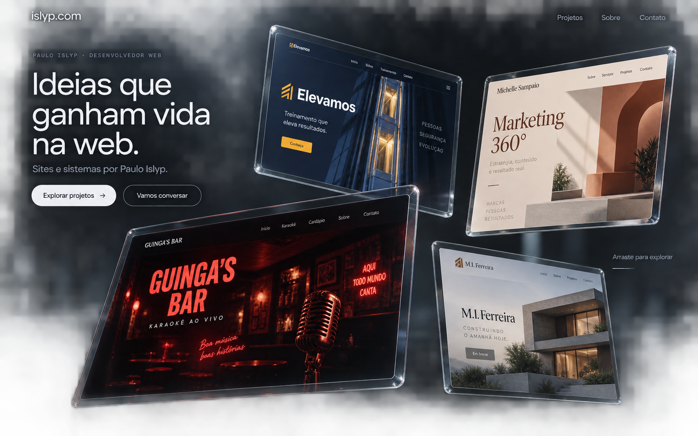

### M02 — Vidro com texto central

**Arquivo:** [M02-vidro-texto-central.png](design/modelos/M02-vidro-texto-central.png)  
**Derivado de:** M01.

- Frase solicitada pelo usuário centralizada, acompanhada do texto menor e da seta.
- Quatro monitores ao redor, com escalas e ângulos diferentes.
- Guinga’s Bar grande e parcialmente cortado na borda inferior esquerda.
- Iluminação azul-acinzentada difusa, fundo atmosférico e reflexos suaves.
- **Feedback:** o usuário pediu telas um pouco menores, mais telas distantes e mais detalhes no fundo.
- **Para retomar:** referência do texto central e da iluminação usada posteriormente no M05.

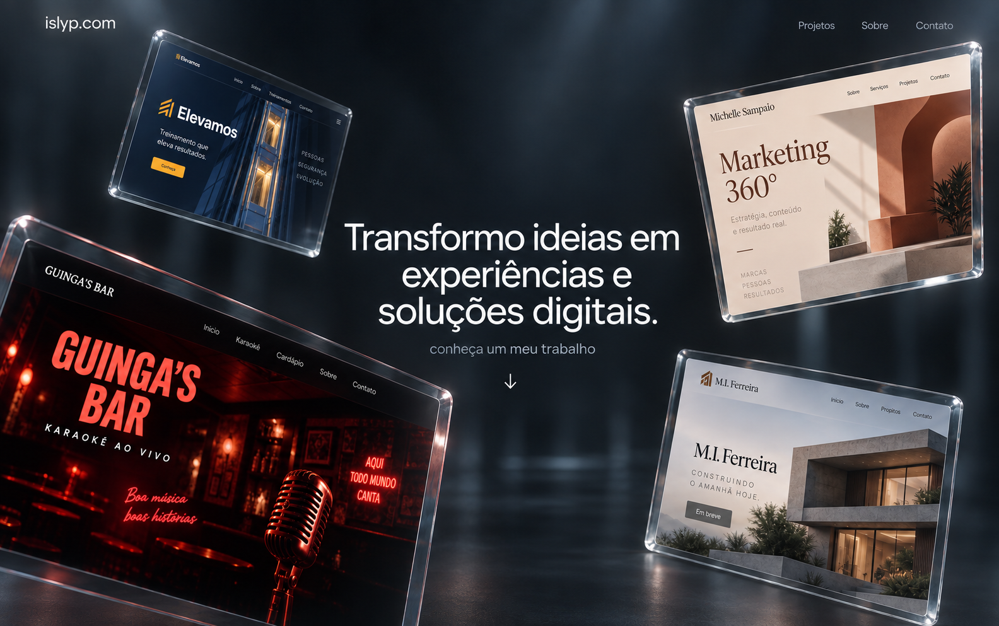

### M03 — Galeria arquitetônica

**Arquivo:** [M03-galeria-arquitetonica.png](design/modelos/M03-galeria-arquitetonica.png)  
**Derivado de:** M02.

- Quatro telas principais menores e quatro telas secundárias ao fundo.
- Ambiente de galeria com estruturas arquitetônicas escuras, iluminação pontual, plantas e piso com reflexos.
- Páginas ilustrativas adicionais dos mesmos projetos, incluindo repertório, blog e trabalhos.
- **Feedback:** o usuário preferiu a ideia de um **vazio ao fundo**, com apenas alguns objetos passando.
- **Para retomar:** alternativa arquitetônica arquivada para comparação; sua ambientação não deve ser presumida como preferência atual.

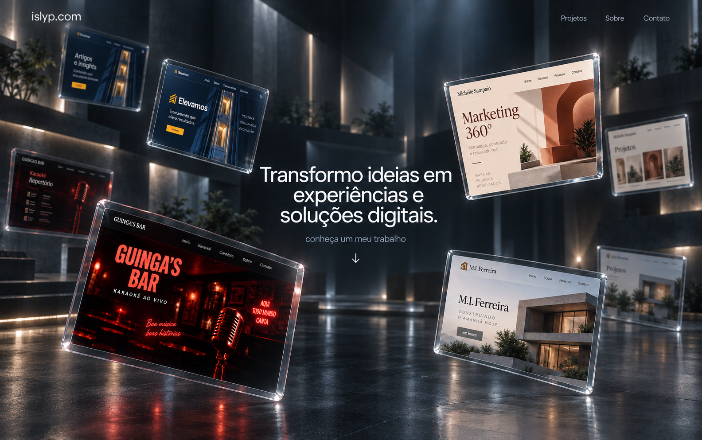

### M04 — Vazio escuro com objetos

**Arquivo:** [M04-vazio-escuro-objetos.png](design/modelos/M04-vazio-escuro-objetos.png)  
**Derivado de:** M03.

- Ambiente quase preto, abstrato, com sensação de vazio e suspensão.
- Oito telas em diferentes profundidades, com as distantes mais suaves e escuras.
- Poucos objetos de vidro: anel, cápsula e pequeno prisma, sugerindo passagem e movimento.
- Texto preservado no centro.
- **Feedback:** o usuário disse “perfeito”, mas pediu o fundo com a iluminação das primeiras imagens. Isso registra uma preferência pela composição, não uma identidade definitivamente escolhida.
- **Para retomar:** referência da distribuição dos monitores e dos objetos em um fundo vazio.

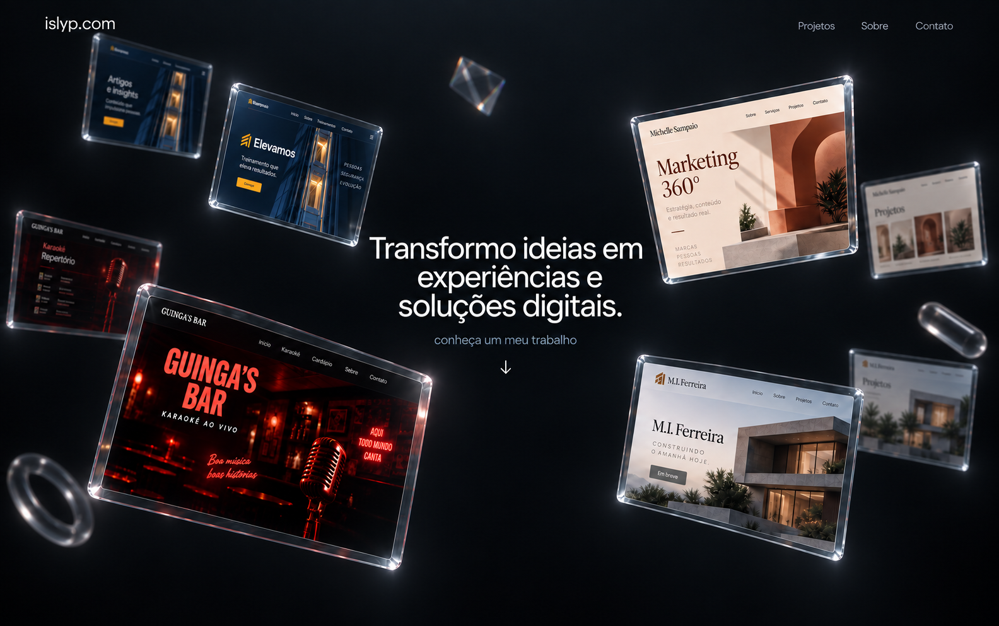

### M05 — Vazio iluminado

**Arquivo:** [M05-vazio-iluminado.png](design/modelos/M05-vazio-iluminado.png)  
**Referências:** composição do M04 + atmosfera de iluminação do M02.

- Mantém as oito telas e os poucos objetos de vidro do M04.
- Recupera a iluminação difusa azul-acinzentada, a névoa suave e os reflexos das primeiras imagens.
- Fundo abstrato iluminado, sem a arquitetura explícita do M03; há sugestão de reflexão na região inferior.
- Texto central livre, com boa separação do ambiente.
- **Feedback:** após essa versão, o usuário pediu um brainstorm com outros ambientes. Não houve escolha final.
- **Para retomar:** referência de equilíbrio entre vazio, luz e material de vidro.

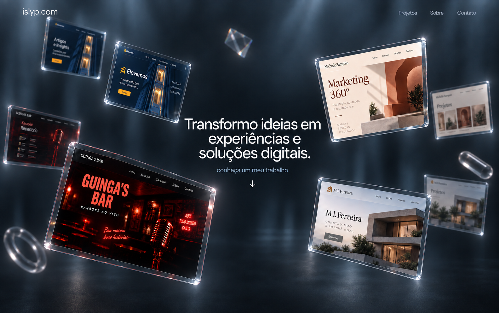

### M06 — Espaço orbital

**Arquivo:** [M06-espaco-orbital.png](design/modelos/M06-espaco-orbital.png)  
**Derivado de:** M05, como alternativa de brainstorm.

- Espaço escuro, estrelas e atmosfera azul profunda.
- Telas e objetos distribuídos como se orbitassem o texto central.
- Arcos sutis e variação de perspectiva sugerem uma trajetória orbital.
- Iluminação concentrada nas bordas do vidro e nos projetos.
- **Intenção futura:** explorar movimento orbital lento sem prejudicar a leitura ou o arraste.
- **Status:** alternativa aberta, sem avaliação individual do usuário após a geração.

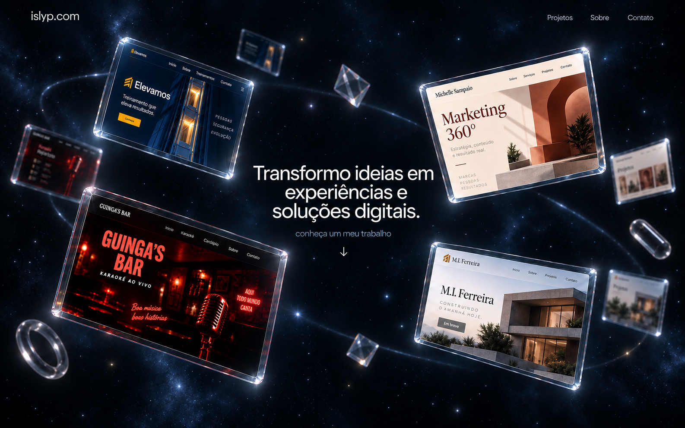

### M07 — Céu claro de praia

**Arquivo:** [M07-ceu-praia.png](design/modelos/M07-ceu-praia.png)  
**Derivado de:** M05, como alternativa de brainstorm.

- Céu azul claro, nuvens iluminadas e mar distante junto à base da imagem.
- Reflexos claros no vidro, com sensação de luz natural e espaço aberto.
- Texto central em azul-escuro para contraste com o céu.
- Telas dos projetos preservam suas próprias cores.
- **Status:** alternativa aberta, sem avaliação individual do usuário após a geração.
- **Para retomar:** direção mais clara, leve e diurna.

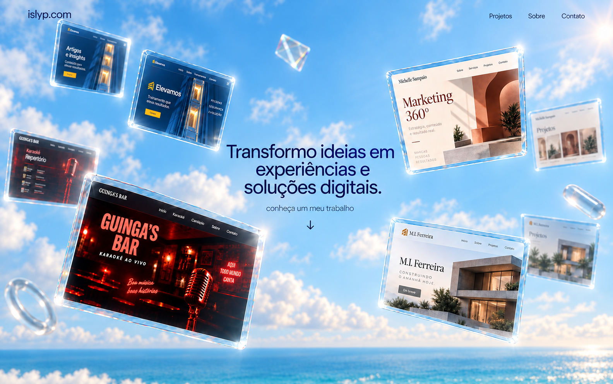

### M08 — Do céu à cidade ao entardecer

**Arquivo:** [M08-ceu-cidade-entardecer.png](design/modelos/M08-ceu-cidade-entardecer.png)  
**Derivado de:** M05, como alternativa de brainstorm.

- Imagem longa para explorar a sequência **hero no céu → descida → cidade → Sobre**.
- Céu com nuvens e iluminação de entardecer, incluindo uma faixa quente no horizonte.
- Monitores de vidro flutuam na parte superior.
- Prédios surgem em camadas, com detalhes de fachadas, sombras e janelas acesas.
- Seção Sobre com texto à direita e um espaço “Sua foto” dentro de uma moldura de vidro à esquerda.
- **Feedback:** o usuário pediu uma pessoa aleatória provisória, recortada e sem moldura; pediu também céu realmente noturno e prédios tratados como silhuetas, luz e sombra.
- **Para retomar:** referência da sequência de descida e da integração entre hero e Sobre. A versão noturna está no M09.

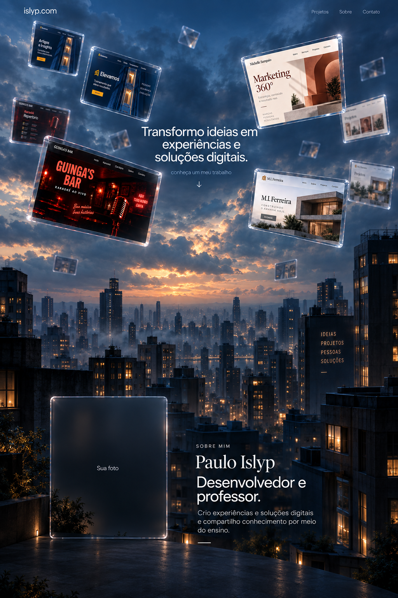

### M09 — Cidade noturna com retrato recortado

**Arquivo:** [M09-cidade-noturna-retrato-recortado.png](design/modelos/M09-cidade-noturna-retrato-recortado.png)  
**Derivado de:** M08.  
**Status:** estudo anterior usado como base visual do M10; não escolhido como identidade final.

- Céu efetivamente noturno, com nuvens escuras, estrelas discretas e luz fria.
- A cena desce até uma cidade em camadas de silhuetas pretas e azul-escuras.
- Pontos de luz nas janelas, alguns sinais luminosos distantes e sombras sugerem profundidade.
- Monitores de vidro continuam no hero.
- Na seção Sobre, uma **pessoa fictícia provisória** aparece recortada diretamente sobre o cenário, sem vidro ou moldura.
- A remoção da moldura se aplica ao retrato. O vidro dos monitores continua fazendo parte do estudo.
- **Para retomar:** referência da direção cidade noturna com monitores flutuantes, sombras, luzes e retrato integrado ao fundo. A versão com notebook e continuação da página está no M10.

**Importante:** a pessoa da imagem não é Paulo Islyp. Foi gerada como substituto temporário, conforme solicitado. O recorte está representado dentro da imagem de design; não foi produzido um arquivo separado de retrato com transparência.

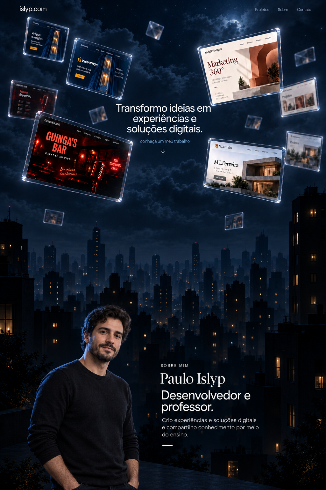

### M10 — Página completa na cidade noturna

**Referência inicial:** M09.  
**Formato:** três imagens consecutivas da mesma proposta de página desktop.  
**Status:** novo estudo de design; identidade final não escolhida.

O usuário trouxe uma nova estrutura detalhada para a página e pediu o restante do design usando a última imagem como base. O M10 aplica a atmosfera noturna do M09 a essa estrutura e representa também a mudança do hero para um notebook.

| Quadro | Conteúdo | Arquivo |
|---|---|---|
| **M10-01** | Hero com notebook, Sobre, faixa de tecnologias e cards-âncora | [M10-01-hero-sobre-tecnologias.png](design/modelos/M10-01-hero-sobre-tecnologias.png) |
| **M10-02** | Apresentações de Guinga’s Bar e Elevamos | [M10-02-projetos-guingas-elevamos.png](design/modelos/M10-02-projetos-guingas-elevamos.png) |
| **M10-03** | Michelle Sampaio, M.I. Ferreira, Laboratório e contato | [M10-03-projetos-laboratorio-contato.png](design/modelos/M10-03-projetos-laboratorio-contato.png) |

**Composição proposta:**

- No hero, um notebook em perspectiva representa o vídeo de demonstração dos sites. A tela mostra um quadro ilustrativo do Guinga’s Bar.
- A pessoa fictícia do M09 continua como recorte provisório na seção Sobre.
- A faixa de tecnologias percorre a largura da página. A animação está somente planejada.
- Os quatro cards antecipam os projetos. Na implementação futura, devem navegar para âncoras internas, embora a imagem use símbolos de seta ilustrativos.
- Os projetos aparecem em seções maiores, com celulares 3D mostrando versões mobile ilustrativas. O posicionamento do celular e do texto alterna para variar a leitura.
- As apresentações possuem nome, descrição, funcionalidades e espaço de tecnologias, marcado como provisório.
- M.I. Ferreira está identificado como “Em breve” / “Em preparação”, pois não foi informado um endereço publicado.
- O Laboratório tem três **categorias de exemplo**: “Experimentos 3D”, “Interfaces e movimento” e “Pequenas ferramentas”. Não são afirmações de projetos concluídos; aparecem como “Em planejamento”. Os projetos reais ainda serão informados pelo usuário.
- O rodapé propõe “O que você quer construir?” e “Conversar sobre um projeto”. E-mail, LinkedIn e GitHub aparecem como rótulos; os endereços reais ainda precisam ser fornecidos.

**Limites deste estudo:**

- As três imagens representam uma mesma página, mas ainda não são um layout implementado ou uma imagem única com emendas perfeitas. Ritmo, escala e continuidade das seções poderão ser refinados.
- Não foram criados vídeo, carrossel animado, âncoras funcionais, modelos 3D utilizáveis ou arquivos separados de recorte.
- Interfaces dentro dos dispositivos, símbolos e textos secundários são ilustrativos. A versão final deverá usar os projetos reais e revisão de conteúdo.
- A estrutura veio do pedido mais recente do usuário; os textos complementares e as categorias do Laboratório são propostas para discussão.

**Método de criação:** ferramenta nativa de geração de imagens. Os [prompts usados no M10](design/M10-PROMPTS.md) foram arquivados para permitir a retomada do estudo.

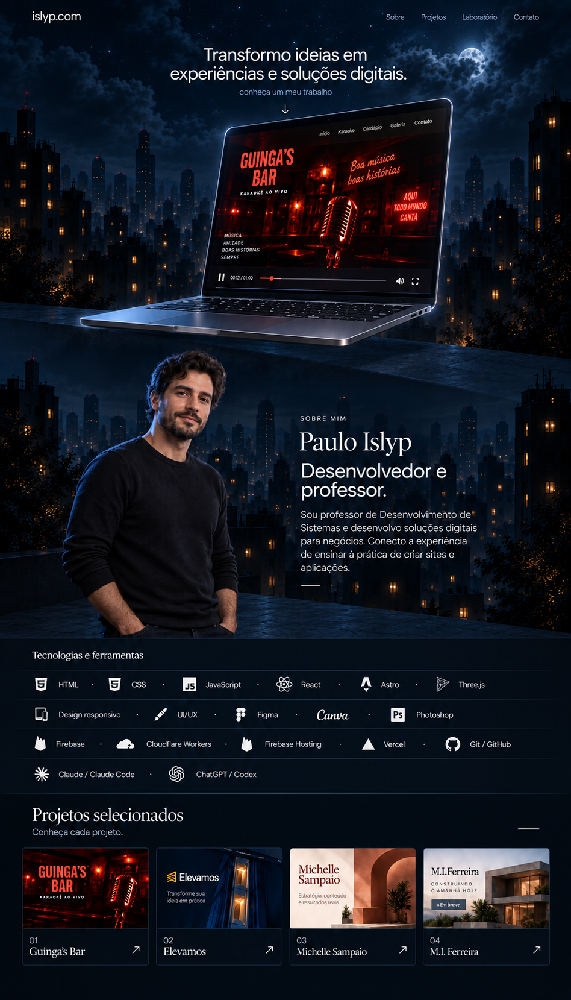

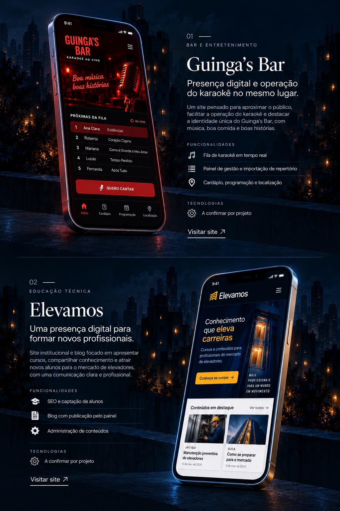

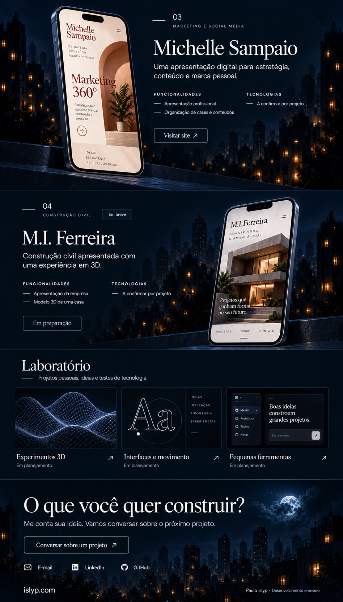

### M11 — Página com cidade contínua

**Arquivo:** [M11-pagina-cidade-continua.png](design/modelos/M11-pagina-cidade-continua.png)  
**Referências:** os três quadros do M10.  
**Formato:** uma única imagem vertical de 724 × 2172 px, representando a página desktop inteira.  
**Status:** estudo de design para discussão; nenhuma identidade escolhida.

O usuário pediu refazer a composição, acrescentando tecnologias com ícones e nomes que atravessam a tela, apresentações dos projetos com celulares 3D e um fundo que continua descendo junto com a página, chegando progressivamente ao final da mesma imagem de cenário.

- O notebook e o retrato recortado permanecem no início da página.
- A seção “Tecnologias utilizadas” tem faixas de largura total, com itens parcialmente cortados e repetidos nas extremidades para representar o carrossel contínuo.
- Os cards antecipam os quatro projetos e continuam previstos como âncoras internas.
- Guinga’s Bar, Elevamos, Michelle Sampaio e M.I. Ferreira têm apresentações próprias com celular em perspectiva, nome e explicação. M.I. Ferreira recebe a indicação “Em breve”.
- O repertório geral de tecnologias não é atribuído automaticamente aos projetos: as apresentações continuam marcadas com “Tecnologias: a confirmar por projeto”.
- O cenário noturno ocupa toda a composição e progride do céu e dos prédios distantes para fachadas mais próximas e a rua no rodapé. Janelas iluminadas e sombras sustentam a profundidade.
- Laboratório e contato aparecem depois dos quatro projetos, mantendo a estrutura solicitada anteriormente.
- A chamada menor do hero passa a “Conheça meu trabalho”, como ajuste editorial provisório.

**Conferência e limites:** os quatro projetos estão presentes com explicações; o quarto recebeu espaço próprio em uma revisão. Outra revisão substituiu itens extras gerados nas bordas do carrossel por repetições da lista informada. As interfaces, os ícones e o retrato continuam ilustrativos. A composição ainda sugere patamares entre algumas áreas; a continuidade das fachadas e a transição visual entre seções podem ser refinadas em novas imagens. O carrossel, o vídeo e a descida são intenções representadas estaticamente, sem animação implementada.

**Feedback posterior:** “não está continuo. vamos fazer do 0 apenas com a ideia dessa iamgem, continuando a partir dela”. O M11 não atingiu o requisito de continuidade do cenário. Seu nome foi mantido como registro da intenção, não como confirmação de que o resultado funcionou. A reconstrução está no M12.

**Método:** ferramenta nativa de geração de imagens. Os [prompts e as revisões do M11](design/M11-PROMPTS.md) foram arquivados; os modelos anteriores permanecem intactos.

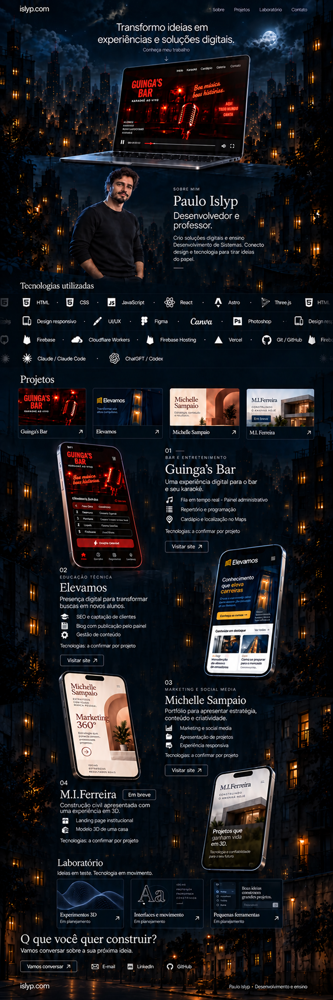

### M12 — Fachadas contínuas, do céu à rua

**Origem:** reconstrução do zero, usando a ideia do M11 como referência conceitual, sem reutilizar a imagem do M11 na geração.  
**Formato:** duas imagens de 724 × 2172 px: cenário e página completa.  
**Status:** o usuário elogiou o restante do layout, pedindo alterar somente a quantidade de fileiras de tecnologias e o ponto de vista da cidade. O M13 incorpora essas mudanças.

| Arquivo | Papel no estudo |
|---|---|
| [M12-01-fundo-cidade.png](design/modelos/M12-01-fundo-cidade.png) | Fundo gerado primeiro: céu, fachadas verticais e uma única rua na base. |
| [M12-02-pagina-fachadas-continuas.png](design/modelos/M12-02-pagina-fachadas-continuas.png) | Página completa composta sobre esse cenário, com ajuste posterior das faixas de tecnologias. |

**Mudança principal:** a continuidade é definida pela arquitetura antes de inserir o conteúdo. As fachadas laterais têm linhas verticais que podem ser acompanhadas dos telhados até a rua; não há uma nova paisagem ou um terraço para cada seção. O fundo separado permite retomar essa base em novos estudos de layout.

- Hero com notebook, retrato fictício recortado e apresentação como desenvolvedor e professor.
- Tecnologias com ícones e nomes em quatro faixas atravessando as bordas físicas da imagem. As extremidades repetem e cortam os itens da lista para sugerir circulação.
- Cards-âncora e quatro apresentações com celulares em perspectiva, nome, explicação e espaço provisório para tecnologias.
- M.I. Ferreira permanece com “Em breve”; Laboratório apresenta categorias em planejamento.
- Contato junto à base dos prédios, acima da única rua do cenário.
- A pessoa usada nesta reconstrução também é fictícia e provisória, sem moldura de vidro.

**Conferência:** fachadas contínuas visíveis nas margens, uma lua no topo e uma rua na base; quatro projetos presentes com descrições; faixa de tecnologias corrigida para ultrapassar a coluna central. A geração da página reinterpretou alguns detalhes do fundo, sem preservação pixel a pixel, mas manteve sua organização espacial. Vídeo, rolagem, carrossel, links e 3D continuam representações estáticas. Interfaces e símbolos são ilustrativos, sujeitos à substituição pelos materiais reais.

**Método:** ferramenta nativa de geração de imagens, primeiro o cenário e depois a composição. Os [prompts e arquivos do M12](design/M12-PROMPTS.md) estão registrados. Os estudos anteriores foram preservados.

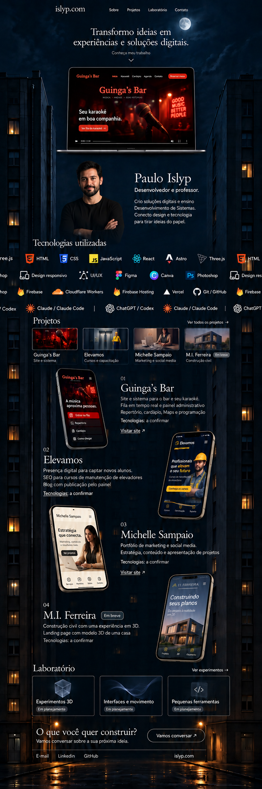

### M13 — Cidade aérea com duas fileiras de tecnologias

**Referências:** estrutura do M12 e novo background aéreo gerado a partir do pedido do usuário.  
**Formato:** duas imagens de 724 × 2172 px.  
**Status histórico:** background escolhido explicitamente naquele momento. Depois o usuário forneceu uma nova referência para o fundo, aplicada no M14. O M13 permanece arquivado.

| Arquivo | Papel no estudo |
|---|---|
| [M13-01-background-aereo.png](design/modelos/M13-01-background-aereo.png) | Background original escolhido: cidade noturna vista de cima, vários prédios, telhados, ruas distantes, pontos de luz e sombras. |
| [M13-02-pagina-cidade-aerea.png](design/modelos/M13-02-pagina-cidade-aerea.png) | Aplicação do fundo escolhido ao layout do M12, com duas fileiras de tecnologias. |

O usuário pediu “uma ou duas fileiras apenas” para as tecnologias, disse que “o resto está perfeito” e solicitou cidade vista de cima com mais prédios. Após a geração do cenário isolado, confirmou: **“quero esse background”**. Essa decisão é específica sobre o cenário; não pressupõe aprovação de toda a identidade ou da nova composição.

- O cenário oferece uma vista aérea oblíqua, com prédios pequenos e distantes perto do horizonte e telhados maiores em primeiro plano. É uma única paisagem contínua.
- O original do background foi salvo sem alterações. Ele é a referência escolhida para a próxima etapa.
- A composição mantém notebook, retrato fictício recortado, apresentação, cards, quatro projetos com celulares 3D, Laboratório e contato, conforme a estrutura elogiada no M12.
- “Tecnologias utilizadas” possui **exatamente duas fileiras**, com ícones e nomes cortados nas bordas para sugerir passagem contínua. O repertório inteiro não precisa aparecer neste quadro estático.
- O primeiro ciclo proposto agrupa desenvolvimento, serviços e publicação; o segundo agrupa interface, design e assistentes. São decisões de organização, sujeitas a refinamento, sem excluir itens da lista informada.
- O rodapé continua sobre a vista aérea, próximo aos telhados maiores do mesmo cenário, sem trocar para uma rua vista ao nível do chão.

**Conferência e limites:** duas fileiras presentes; quatro apresentações com descrição; perspectiva aérea contínua; fundo original arquivado por cópia intacta. A composição gerada não garante identidade pixel a pixel com o background, cujo arquivo separado permanece como referência. Animações, vídeo, links e modelos 3D funcionais ainda não foram implementados. Foto, interfaces e símbolos continuam ilustrativos.

**Método:** ferramenta nativa de geração de imagens. Os [prompts e arquivos do M13](design/M13-PROMPTS.md) estão registrados.

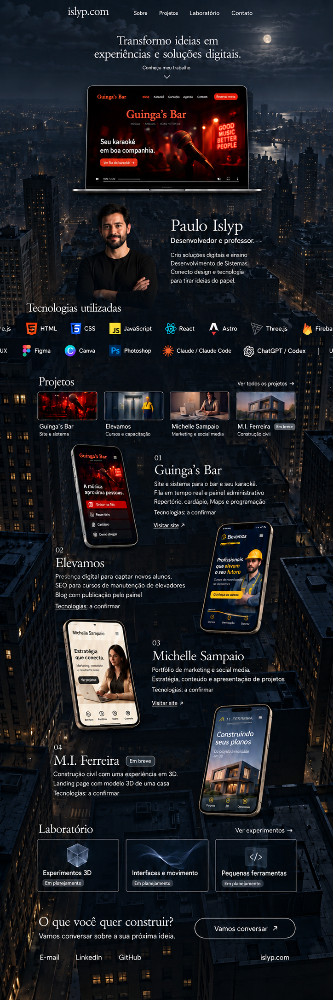

### M14 — Fundo da referência fornecida

**Referência visual:** [imagem enviada pelo usuário](design/referencias/M14-referencia-fornecida.png).  
**Fonte do layout:** M13-02, preservando a estrutura elogiada no M12 e as duas fileiras de tecnologias.  
**Status:** estudo produzido conforme a nova referência de fundo; ainda sem avaliação posterior.

O pedido foi “faça usando o background dessa imagem”. A imagem enviada contém monitores de vidro e outro retrato provisório, mas a instrução se refere ao **background**. Por isso, esses elementos não substituíram o notebook e o retrato do layout atual.

| Arquivo | Papel e dimensões |
|---|---|
| [M14-referencia-fornecida.png](design/referencias/M14-referencia-fornecida.png) | Cópia intacta da imagem enviada, 1024 × 1536 px. |
| [M14-01-fundo-referencia.png](design/modelos/M14-01-fundo-referencia.png) | Cenário adaptado sem elementos de interface e prolongado verticalmente, 724 × 2172 px. |
| [M14-02-pagina-fundo-referencia.png](design/modelos/M14-02-pagina-fundo-referencia.png) | Página completa sobre o novo cenário, 724 × 2171 px. |

- Céu azul-escuro com nuvens marcadas, estrelas discretas e lua parcialmente encoberta, seguindo a referência.
- Cidade em camadas de silhuetas com pequenas janelas âmbar; continuidade vertical entre áreas distantes e prédios próximos.
- Notebook, pessoa fictícia recortada, apresentação, duas fileiras de tecnologias, cards, quatro apresentações com celulares 3D, Laboratório e contato preservados como estrutura.
- O fundo é uma composição única. A imagem não reinicia o céu ou cria outro cenário para cada seção.
- A referência aérea do M13 permanece como histórico; a orientação atual vem do arquivo enviado pelo usuário.

**Conferência e limites:** duas fileiras de tecnologias e quatro projetos presentes; cenário com a linguagem visual da referência; céu concentrado no topo e cidade continuando até a base. A retirada dos elementos e a extensão do background foram feitas por geração, portanto o fundo adaptado não é uma extração pixel a pixel. O original enviado foi preservado separadamente. A composição continua estática; foto, interfaces e símbolos são ilustrativos.

**Método:** ferramenta nativa de geração de imagens. Os [prompts e arquivos do M14](design/M14-PROMPTS.md) foram arquivados.

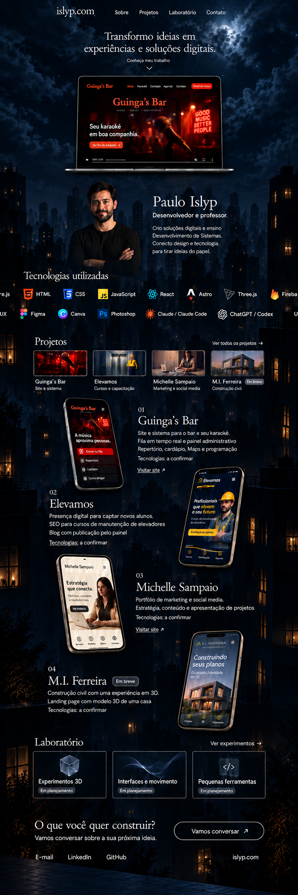

### M15 — Hero de vidro da referência

**Arquivo:** [M15-pagina-hero-vidro.png](design/modelos/M15-pagina-hero-vidro.png)  
**Formato:** página vertical completa, 724 × 2172 px.  
**Referências:** M14-02 como fonte do restante da página e [imagem enviada pelo usuário](design/referencias/M14-referencia-fornecida.png) como referência do hero.  
**Status:** estudo produzido conforme o pedido; ainda sem avaliação posterior.

O pedido “agora faça como no hero que mandei tambem” estende o uso da referência ao hero. O notebook é substituído pelos monitores de vidro, enquanto a estrutura inferior continua.

- Texto branco sem serifa no centro da composição, com “Transformo ideias em experiências e soluções digitais.”, chamada menor e seta para baixo.
- Elevamos na parte superior esquerda e Michelle Sampaio na superior direita; Guinga’s Bar em primeiro plano à esquerda e M.I. Ferreira à direita.
- Bordas transparentes, reflexos azulados, tamanhos e perspectivas diferentes, telas menores distantes e poucos objetos de vidro.
- O hero ocupa aproximadamente o primeiro quarto da imagem. As seções seguintes foram acomodadas abaixo, mantendo o retrato provisório, duas fileiras de tecnologias, cards, quatro apresentações mobile, Laboratório e contato.
- O fundo noturno segue como uma única cidade em silhuetas; o retrato continua recortado sem moldura.

**Conferência e limites:** notebook removido; frase entre os monitores; duas fileiras de tecnologias e quatro apresentações de projetos presentes; rodapé preservado. A imagem adapta a referência e não a reproduz pixel a pixel. Arraste, animações, links e modelos 3D continuam planejados, sem implementação. O retorno dos monitores permite retomar as intenções de interação registradas no item 4.

**Método:** ferramenta nativa de geração de imagens. [Prompt e referências do M15](design/M15-PROMPTS.md) arquivados; M14 preservado.

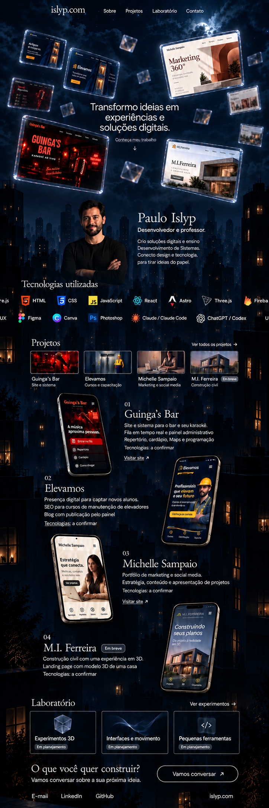

### M16 — Galeria clara contínua

**Arquivo:** [M16-background-galeria-clara.png](design/modelos/M16-background-galeria-clara.png)  
**Referência:** [imagem clara fornecida pelo usuário](design/referencias/M16-referencia-clara.png), originalmente “ChatGPT Image 14 de set. de 2026, 22_55_34.png”.  
**Formato:** background isolado, 724 × 2172 px, proporção 1:3.  
**Status:** teste de outra direção de fundo; não substitui automaticamente a identidade ou o cenário em uso.

O usuário pediu criar uma imagem de background baseada no ambiente da referência, considerando continuidade na descida, interação e animação. A entrega é o cenário vazio, preparado para receber o conteúdo em camadas.

- Ambiente claro branco perolado e cinza frio, com vidro translúcido, luz diagonal suave e reflexos discretos.
- Um único átrio vertical. As estruturas laterais seguem de cima a baixo e chegam ao mesmo piso, localizado apenas no final da composição.
- Centro amplo e de baixo contraste para textos e painéis; detalhes nas laterais ajudam a perceber a progressão da rolagem.
- Sem textos, logos, capturas, painéis, pessoas ou objetos flutuantes incorporados ao fundo. O conteúdo da imagem de referência não altera a lista real de projetos ou tecnologias.
- A intenção é revelar o cenário lentamente ao rolar, mantendo monitores arrastáveis e objetos animados como camadas independentes sobre a base.

**Relação com a implementação atual:** o site já possui cenário que avança a 28% da distância rolada e painéis com movimento e arraste. Esses comportamentos podem servir como ponto de partida para um futuro teste do M16. Nesta entrega não foram alterados código, controles ou o arquivo de background aplicado. A eventual composição clara precisará avaliar a leitura dos textos e o contraste dos painéis.

**Conferência e limites:** continuidade visual, centro livre e um único piso; arquivo sem elementos de interface. O PNG é estático e não contém interação, animação ou camadas de profundidade separadas. As intenções de movimento estão documentadas para a etapa de aplicação.

**Método:** ferramenta nativa de geração de imagens. [Prompt, referência e proposta de movimento do M16](design/M16-PROMPTS.md) arquivados; originais preservados.

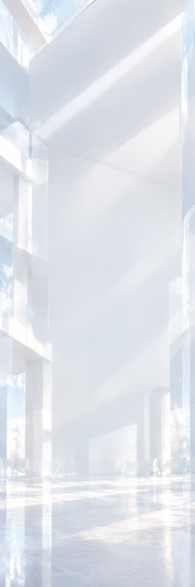

## 6. Comportamento imaginado para a direção cidade

Este roteiro começou nos M08/M09 e foi reafirmado no pedido do M11 para a página inteira, que naquele momento usava notebook no hero. No M15 o hero volta aos monitores de vidro. A intenção é percorrer um mesmo cenário vertical até seu final; tecnologia, velocidades e tempos de animação permanecem em aberto.

Após o M11, o usuário esclareceu que o resultado não era contínuo. O M12 passa a usar fachadas que atravessam a página inteira como referência verificável dessa continuidade. Não basta ter cidade em todas as seções: é preciso manter a mesma arquitetura entre elas.

**Histórico do M13:** foi explorada uma vista aérea que progredia da cidade distante aos telhados próximos.

**Referência atual após o M14:** o usuário enviou um cenário com céu de nuvens noturnas e cidade em silhuetas e pediu usar esse background. A progressão segue do céu para regiões mais próximas da mesma cidade, preservando uma única paisagem até a base. O roteiro abaixo registra a intenção original; velocidade, enquadramento e comportamento final da rolagem ainda precisam ser definidos.

1. **Entrada no hero:** câmera aparente no céu, com texto central e monitores de vidro em diferentes distâncias na versão atual M15.
2. **Início da rolagem:** a composição passa a dar a sensação de descida, revelando regiões mais baixas do cenário.
3. **Aproximação da cidade:** topos de prédios surgem e as camadas de silhuetas tornam a profundidade perceptível.
4. **Seção Sobre:** retrato e apresentação de Paulo como desenvolvedor e professor aparecem integrados à cidade.
5. **Continuação:** tecnologias, cards-âncora e apresentações dos projetos acompanham a descida para regiões mais baixas e próximas das fachadas, mantendo o mesmo cenário de fundo.
6. **Chegada ao final:** Laboratório e contato ficam próximos à base dos prédios e à rua. O final da página se aproxima do final da imagem de fundo, sem reiniciar o céu ou repetir o horizonte em cada seção.

É uma **simulação visual de descida de câmera associada à rolagem**, representada por uma imagem estática. A imagem longa não define, sozinha, o comportamento final de scroll, a velocidade das camadas ou a experiência no celular.

### Texto provisório da seção Sobre

> SOBRE MIM
>
> Paulo Islyp
>
> Desenvolvedor e professor.
>
> Crio experiências e soluções digitais e compartilho conhecimento por meio do ensino.

Esse texto foi proposto para compor M08/M09. A atuação como desenvolvedor e professor foi informada pelo usuário; o restante da redação poderá ser refeito com detalhes de sua trajetória, área de ensino e forma de trabalho.

No M10, após o usuário especificar a experiência como professor de Desenvolvimento de Sistemas, foi explorada esta versão:

> Sou professor de Desenvolvimento de Sistemas e desenvolvo soluções digitais para negócios. Conecto a experiência de ensinar à prática de criar sites e aplicações.

Essa redação também é provisória.

## 7. Explorações anteriores aos modelos em imagem

Estas referências são históricas. Os códigos **E01–E04** distinguem estudos iniciais dos modelos de imagem **M01–M16**.

| Código | Direção | Paleta explorada | Tipografia explorada | Situação |
|---|---|---|---|---|
| **E01** | Essencial | Base `#F3F2EC`, texto `#20251F`, acento `#2B5D3A` | DM Sans; IBM Plex Mono nos detalhes | Exploração inicial; não escolhida. |
| **E02** | Terminal | Base `#0C1014`, texto `#F1F5F4`, acento `#CBF568` | Space Grotesk; IBM Plex Mono nos detalhes | Exploração inicial; não escolhida. |
| **E03** | Autoral | Base `#F8F1E7`, texto `#322824`, acento `#AC3D28` | Instrument Serif; IBM Plex Mono nos detalhes | Exploração inicial; não escolhida. |
| **E04** | Estudo de interação com telas flutuantes | Ambiente claro/escuro e vidro ilustrativo | Tipografia e composição de teste | Referência de arraste, seleção e inércia; não é o site em desenvolvimento. |

**Arquivos preservados:**

- [E01–E03 — estudo das três direções](design/referencias-iniciais/E01-E03-direcoes-iniciais.html).
- [E01 — prévia estática de Essencial](design/referencias-iniciais/E01-essencial-previa.png). Foi capturada com fontes de fallback durante a conferência; serve como registro da composição, não como prova da tipografia final.
- [E04 — estudo de interação](design/referencias-iniciais/E04-estudo-de-interacao.html).

Os arquivos HTML são cópias dos fragmentos de visualização usados na conversa, guardados apenas como referências históricas. Não constituem um site pronto. Algumas opções dependem do ambiente de visualização e de fontes externas. **A orientação atual do usuário é continuar o planejamento com imagens de design.**

## 8. Preferências registradas e escolhas em aberto

### Preferências manifestadas

- A aparência dos monitores transparentes de vidro agradou.
- O texto deve ficar centralizado, com a seta abaixo da chamada.
- Perspectiva, tamanhos diferentes e telas menores ao fundo são parte da ideia.
- O fundo vazio com poucos objetos agradou; houve pedido de recuperar uma iluminação atmosférica suave.
- Os testes de espaço, praia e cidade são brainstorm e permanecem disponíveis.
- Para a **variação da cidade**, o pedido mais recente foi noite de fato, prédios em silhueta, pontos de luz e sombras.
- Na seção Sobre dessa variação, a pessoa deve aparecer recortada, sem moldura de vidro.
- O retrato aleatório é temporário; uma foto real poderá ser inserida depois.
- O notebook foi explorado nos M10–M14. No pedido mais recente, o hero passa a seguir os monitores de vidro da imagem fornecida, aplicados no M15.
- O portfólio deve valorizar tanto a experiência de professor quanto a criação de soluções tecnológicas, priorizando clientes de freelancer e servindo também para vagas de desenvolvimento.
- O usuário quer planejar a identidade em conjunto e evitar uma aparência genérica ou “cara de IA”.
- No pedido do M11, reforçou o carrossel de tecnologias com ícones e nomes saindo pelas bordas da tela.
- Para a cidade, confirmou o fundo contínuo acompanhando a descida e se aproximando do final do cenário conforme se chega ao final da página.
- O usuário rejeitou a continuidade do M11 e pediu uma reconstrução do zero a partir da ideia. Preservar essa correção ao retomar a direção cidade.
- O usuário elogiou o restante do M12 e limitou as tecnologias a uma ou duas fileiras animadas.
- **Escolha anterior:** background M13-01, cidade noturna vista de cima com mais prédios e profundidade.
- **Referência atual confirmada:** a imagem enviada no pedido do M14, com nuvens noturnas e cidade em silhuetas. O usuário pediu explicitamente usar seu background.
- No pedido do M15, o usuário também solicitou o hero dessa imagem: monitores de vidro flutuantes, frase no centro e variações de profundidade.

### Ainda não decidido

- Refinamentos da identidade em torno do cenário da imagem fornecida no pedido do M14. As alternativas anteriores continuam arquivadas.
- Paleta, fontes, desenho final da assinatura e demais elementos da identidade.
- Redação definitiva do hero e da seção Sobre.
- Foto real, enquadramento e tratamento do recorte.
- Quais capturas reais dos projetos serão usadas e quais telas secundárias aparecerão.
- Quantidade final de monitores e objetos; limites de movimento e comportamento ao clicar.
- Quais telas dos sites serão exibidas nos monitores e como o movimento desses elementos será apresentado.
- Velocidade e direção da faixa de tecnologias, limitada a uma ou duas fileiras e representada com duas nos M13 a M15, e eventual rotação dos símbolos.
- Mapeamento das tecnologias de cada projeto e escolha dos projetos reais do Laboratório.
- Ritmo da rolagem e forma da descida na direção cidade.
- Composição e interação no celular.
- Refinamento da composição das seções já solicitadas, conteúdo dos estudos de caso e canal principal de contato.
- Tecnologias, implementação, hospedagem e publicação.

## 9. Arquivamento e integridade

- O catálogo contém **dezesseis modelos, M01–M16**, em **vinte e uma imagens selecionadas**. M01–M09, M11, M15 e M16 têm uma imagem cada; M10 possui três quadros sequenciais; M12, M13 e M14 possuem um fundo separado e uma página completa cada.
- A referência clara do M16 foi preservada em `design/referencias/M16-referencia-clara.png`, mantendo intacto o arquivo original em Downloads.
- A imagem fornecida pelo usuário no pedido do M14 foi copiada separadamente para `design/referencias/M14-referencia-fornecida.png`, mantendo intacto o arquivo em Downloads.
- As cópias das imagens foram conferidas por **SHA-256**, preservando o conteúdo dos arquivos de origem.
- Os arquivos originais gerados foram mantidos.
- O arquivo que já existia na raiz, **`Imagem do Codex 14 de set. de 2026, 18_37_22.png`**, tem o mesmo conteúdo do **M05 — Vazio iluminado**. Ele foi preservado no local original.
- As referências E01–E04 foram copiadas para uma pasta separada para não confundir estudos iniciais com a seleção futura.

### Identificação dos arquivos originais

| Modelo | Nome original da imagem gerada |
|---|---|
| M01 | `exec-f0834fe9-f82d-4f6a-9e26-2a5acdcbee72.png` |
| M02 | `exec-04ad7d20-676d-4178-b898-8691eb1aa2dd.png` |
| M03 | `exec-8ccc5671-4bce-49a7-ae2a-c4faa6663f1c.png` |
| M04 | `exec-5b274e08-4879-4bfe-bb38-95e2d1c41a51.png` |
| M05 | `exec-21306fc3-c082-4f84-b80f-a0f15a0aeabd.png` |
| M06 | `exec-6d9f33e6-8bf3-4ee8-9a1d-79c64ed38ed6.png` |
| M07 | `exec-6da520e7-1165-46b3-8c5e-95dfa1459cb5.png` |
| M08 | `exec-85974a65-01ca-4e6c-bac4-8b9b9ea9b918.png` |
| M09 | `exec-b34cb52d-bb34-41ef-80b3-c88ff632e45b.png` |
| M10-01 | `exec-45ab654d-01a3-468d-88f8-cd4dd12a6dc9.png` |
| M10-02 | `exec-ecb43f91-ea03-42ee-b7ec-3fc6cb7ef154.png` |
| M10-03 | `exec-ffda42b7-fca2-416f-82a6-d5b021149998.png` |
| M11 | `exec-79c61ca8-0cf7-46d9-af1e-8160725d68cf.png` |
| M12-01 | `exec-92644c49-bf15-46c9-861c-aaef55af14a2.png` |
| M12-02 | `exec-4b5cc9ad-8892-4552-9722-e8fa3cdb5145.png` |
| M13-01 | `exec-bc7be4cc-c770-4ad2-9d7e-7a829d23afbf.png` |
| M13-02 | `exec-f3dfeaf0-7856-4434-b6ea-cd7faa6da582.png` |
| M14-01 | `exec-b48291ce-b4ce-435a-aa1d-772aa7d56253.png` |
| M14-02 | `exec-fc370f61-d24e-4504-a7f0-f98b1b221946.png` |
| M15 | `exec-4d4474fb-d756-4a8a-84e5-6dee938c1655.png` |
| M16 | `exec-8284a890-b4f6-483a-8bb3-3759f7e557a3.png` |

## 10. Registro das próximas decisões

| Data | Registro | Situação |
|---|---|---|
| 2026-09-14 | Catálogo M01–M09 e referências E01–E04 arquivados. | Nenhuma identidade escolhida. |
| 2026-09-14 | Nova estrutura informada pelo usuário. M10 criado em três quadros: notebook, Sobre, tecnologias, âncoras, apresentações mobile dos quatro projetos, Laboratório e contato. Prompts e imagens arquivados. | Nenhuma identidade escolhida; conteúdo e interações ainda em planejamento. |
| 2026-09-14 | M11 reúne a página em uma imagem: carrossel com ícones e nomes atravessando as bordas, quatro apresentações com celulares 3D e cenário noturno que desce até a rua. Imagem selecionada e prompts arquivados; M10 preservado. | Nenhuma identidade escolhida; aguardando avaliação visual do usuário. |
| 2026-09-14 | O usuário apontou falta de continuidade no M11 e pediu refazer do zero. M12 criado começando pelo cenário único, com fachadas que seguem até a rua, e depois compondo a página sobre ele. Fundo, página e prompts arquivados. | Nenhuma identidade escolhida; M12 aguarda avaliação visual. |
| 2026-09-14 | O usuário elogiou o restante do M12, pediu uma ou duas fileiras de tecnologias e cidade vista de cima com mais prédios. Após ver o novo cenário, disse “quero esse background”. M13 aplica o cenário ao layout e usa duas fileiras. | **Background M13-01 escolhido.** Identidade completa em refinamento; composição M13-02 ainda sem avaliação posterior. |
| 2026-09-14 | O usuário enviou “Imagem do Codex 14 de set. de 2026, 18_51_02.png” e pediu usar seu background. M14 adapta o céu noturno e a cidade em silhuetas à página, mantendo layout e duas fileiras. Referência original, fundo, página e prompts arquivados. | Referência atual de fundo atualizada; M13 preservado como histórico. M14 ainda sem avaliação posterior. |
| 2026-09-14 | O usuário pediu também o hero da referência. M15 substitui o notebook por monitores de vidro ao redor do texto central, preservando cenário, duas fileiras de tecnologias e seções inferiores. Imagem e prompt arquivados. | Hero atual atualizado conforme a referência; novo resultado ainda sem avaliação posterior. |
| 2026-09-14 | O usuário forneceu uma referência clara e pediu testar um background contínuo para descida, interação e animação. M16 criado como cenário vertical isolado, com vidro, luz suave e piso no final. Referência, imagem e proposta de movimento arquivadas. | Alternativa clara em avaliação. Background atual e implementação preservados. |

Para cada atualização futura, acrescentar uma linha com o modelo usado como base, o pedido, o resultado e o feedback. Uma nova variação deve ser preservada como novo arquivo e novo código.
